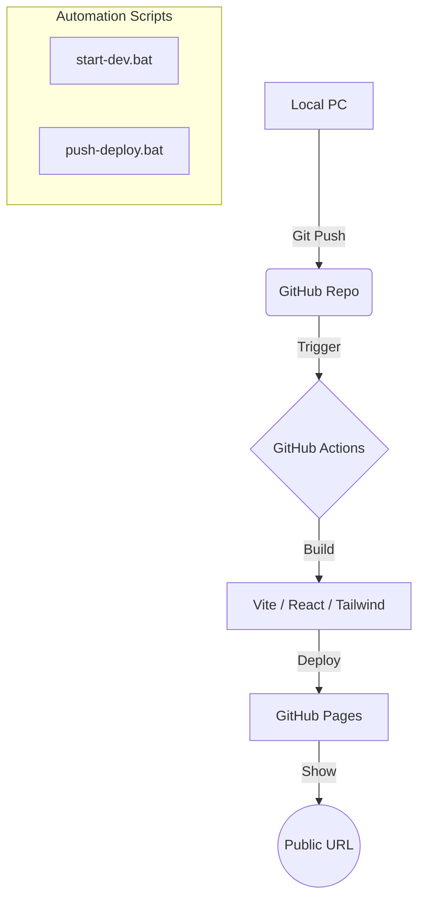

# 051_crossword

クロスワードビルダー - 直感的な操作で盤面を作成できるWebアプリケーション。

## システム構成

## 公開URL

[https://mkt918.github.io/051_crossword/](https://mkt918.github.io/051_crossword/)

## コマンド

- `start-dev.bat`: 依存関係のインストールと開発サーバーの起動。
- `push-deploy.bat`: 変更を保存してGitHubへプッシュ、自動デプロイを実行。

## 特徴

- テンポの良い自動採番
- 文字入力の自動ナビゲーション
- モダンなダークモードUI
